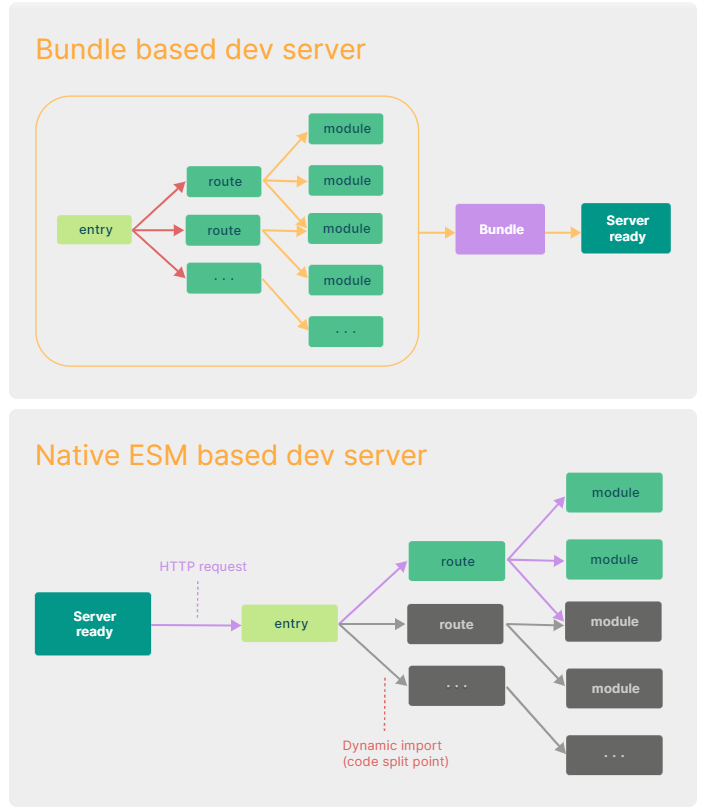
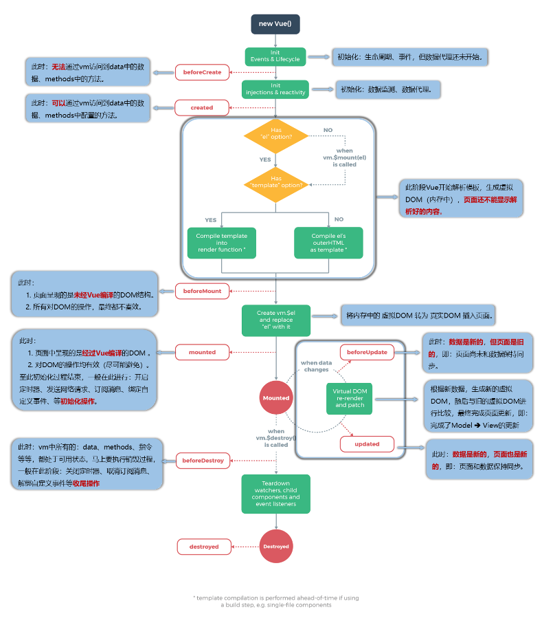
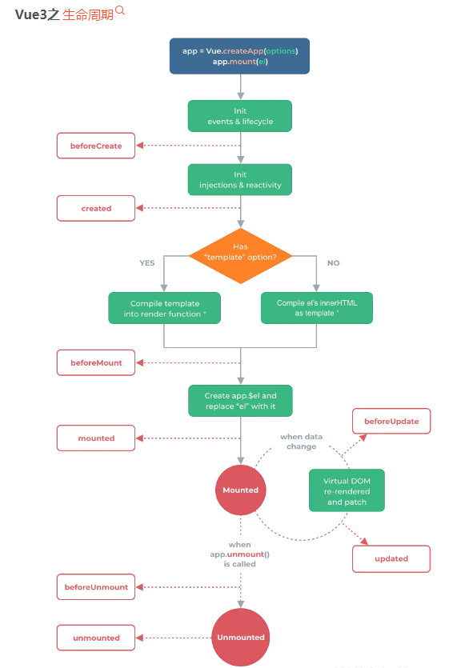
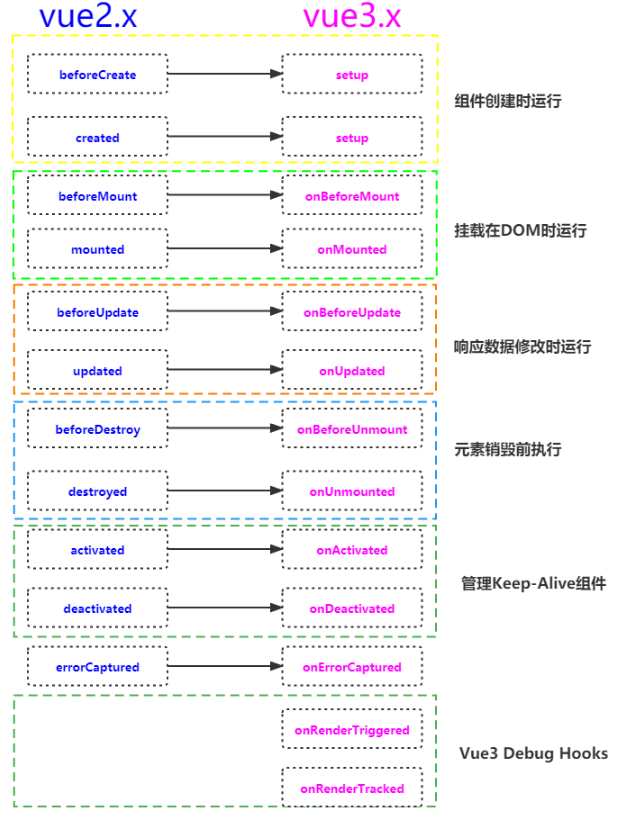
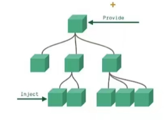

# Vue3快速上手

> 1.vue3简介

- 2020年9月18日，vue.js发布3.0，代号：One Piece（海贼王）
- 耗时2年多、2600+提交、30+个RFC、600+次PR、99位贡献者
- github上的tags地址：https://github.com/vuejs/vue-next/releases/tag/v3.00

> Vue3带来了什么

1. **性能的提升**

    - 打包大小减少41%
    - 初次渲染快55%，更新渲染快133%
    - 内存减少54%
    ......

2. **源码的升级**

    - 使用Proxy代替definePerty实现响应式
    - 重写了虚拟DOM的实现和Three Shaking
    ......

3. **拥抱TypeScript**

    - vue3可以更好的支持TypeScript

4. **新的特性**

    1. Composition API（组合API）
        - setup配置
        - ref与reactive
        - watch与watchEffect
        - provide与inject
        - ......
    
    2. 新的内置组件
        - Fragment
        - Teleport
        - Suspense
    
    3. 其他改变
        - 新的生命周期钩子
        - data选项应始终被声明为一个函数
        - 移除keyCode支持作为v-on的修饰符
        - ......

## 一、创建Vue3.0工程

> 1.使用vue-cli创建

官方文档：https://cli.vuejs.org/zh/guide/creating-a-project.html#vue-create

    ## 查看@vue/cli版本，确保@vue/cli版本在4.5.0以上
    vue --versioin
    ## 安装或者升级你的@vue/cli
    npm install -g @vue/cli
    ## 创建
    vue create vue_test
    ## 启动
    cd vue_test
    npm run serve

> 使用vite创建

官方文档：https://v3.cn.vuejs.org/guide/installation.html#vite


vite官网：https://vitejs.cn

- 什么是vite? ————新一代构建工具。
- 优势如下：
    - 开发环境中，无需打包操作，可快速的冷启动。
    - 轻量快速的热重载（HMR）。
    - 真正的按需编译，不再等待整个应用编译完成。

- 传统构建与vite构建对比图

    

    ```
    ## 创建工程
    npm init vite-app <project-name>
    ## 进入工程目录
    cd <project-name>
    ## 安装依赖
    npm install
    ## 运行
    npm run dev
    ```

## 二、常用Compostion API

官方文档：https://v3.cn.vuejs.org/gulde/compostion-api-introduction.html

> 1.拉开序幕的setup
    
1. 理解：Vue3.0中一个新的配置项，值为一个函数。


2. setup是所有Composition API(组合API) “表演的舞台”。

3. 组件中所用到的：数据、方法等等，均要配置在setup中。

4. setup函数的两个返回值：
    
    - 1.若返回一个对象，则对象中的属性、方法，在模板中均可直接使用。（重点关注！）
    
    - 2.若返回一个渲染函数：则可以自定义渲染内容。（了解）

5. 注意点：

    - 1.尽量不要与vue.x配置混用
        - vue2.x配置（data、methods、computed...）中可以访问到setup中的属性、方法。
        - 但在setup中不能访问vue2.x配置（data、methods、computed...）。
    - 2.setup不能是一个async函数，因为返回值不再是return的对象，而是promise,模板看不到return对象中的属性。

> 2.ref函数

- 作用：定义一个响应式的数据
- 语法：```const xxx = ref(initValue)```
    - 创建一个包含响应式数据的引用对象（reference对象，简称ref对象）。
    - js中操作数据：```xxx.value```
    - 模板中读取数据，不需要.value,直接```<div>{{xxx}}</div>```

- 备注：
    - 接收的数据可以是：基本类型、也可以是对象类型。
    - 基本类型的数据：响应式依然是靠```object.defineProperty()```的```get```与```set```完成的。
    - 对象类型的数据：内部“求助”了Vue3.0中的一个新函数————```reactive```函数。

> 3.reactive函数

- 作用：定义一个对象类型的响应式数据（基本类型不要用它，要用`ref`函数）
- 语法：`const 代理对象= reactive(源对象)`接收一个对象（或数组），返回一个代理对象（proxy的实例对象，简称proxy对象）
- reactive定义的响应式数据是“深层次的”。
- 内部基于ES6的Proxy实现，通过代理对象操作源对象内部数据进行操作。

> 4.Vue3.0中的响应式原理

vue2.x的响应式

- 实现原理：
    - 对象类型：通过`Object.defineProperty()`对属性的读取、修改进行拦截（数据劫持）。
    - 数组类型：通过重新更新数组一些列方法来实现拦截。（对数组的变更方法进行了包裹）。

    ```
    Object.defineProperty(data,'count',{
        get(){},
        set(){}
    })
    ```

- 存在问题：
    - 新增属性、删除属性，界面不会更新。
    - 直接通过下标修改数组，界面不会自动更新。

Vue3.0的响应式

- 实现原理：
    - 通过Proxy（代理）：拦截对象中任意属性的变化，包括：属性值的读写、属性值的添加、属性的删除等。
    - 通过Reflect（反射）：对源对象的属性进行操作。
    - MDN文档中描述的Proxy与Refelect：
        - PRoxy：https://developer.mozilla.org/zh-CN/docs/Web/JavaScript/Reference/Global_Objects/Proxy
        - Reflect：https://developer.mozilla.org/zh-CN/docs/Web/JavaScript/Reference/Global_Objects/Reflect

        ```
        new Proxy(data,{
            //拦截读取属性
            get(target,prop){
                return Reflect.get(target,prop)
            },
            //拦截设置属性值或添加新属性
            set(target,prop,value){
                return Reflect.set(target,prop,value)
            },
            // 拦截删除属性
            deleteProperty(target,prop){
                return Reflect.deleteProperty(target,prop)
            }
        })

        proxy.name = 'tom'
        ```

> 5.reactive对比ref

- 从定义的角度对比：
    - ref用来定义：基本数据类型。
    - reactive用来定义：对象（或数组）类型数据。
    - 备注：ref也可以用来定义对象（或数组）类型数据，它内部会自动通过`reactive`转为代理对象。
- 从原理的角度对比：
    - ref通过`Objet.defineProperty()`的`set`来实现响应式（数据劫持）。
    - reactive通过使用Proxy来实现响应式（数据劫持），并通过Reflect操作源对象内部的数据。
- 从使用的角度对比：
    - ref定义的数据：操作数据需要`.value`，读取数据时模板中直接读取不需要`.value`。
    - reactive定义的数据：操作数据与读取数据：均不需要`.value`

> 6.setup的两个注意点

- setup执行的时机
    - 在beforeCreate之前执行一次，this是`undefined`。
- setup的参数
    - context：上下文对象
        - attrs：值为对象，包含：组件外部传递过来，但没有在props配置中声明的属性，相当于`this.$attrs`。
        - slots：收到的插槽内容，相当于`this.$slots`。
        - emit：分发自定义事件的函数，相当于`this.$emit`。

> 7.计算属性与监视

1.computed函数
    - 与Vue2.x中的computed配置功能一致
    - 写法

    ```
    import {computed} from 'vue'

    setup(){
        ...
        //计算属性——简写
        let fullName = computed(() => {
            return person.firstName + '-' + lastName
        })
        //计算属性——完整
        person.fullName = computed({
            get(){
                return person.firstName + "-" + person.lastName;
            },
            set(value){
                const nameArr = value.split('-');
                person.firstName = nameArr[0]
                person.lastName = nameArr[1]
            }
        });
    }
    ```

2.watch函数
- 与Vue2.x中的watch配置功能一致
- 两个小坑：
    - 监视reactive定义的响应式数据时：oldValue无法正确获取、强制开启了深度监视（deep配置失效）。
    - 监视reactive定义的响应式数据中某个属性时：deep配置有效。

    ```
    //情况一：监视ref定义的响应式数据
    watch(sum,(newValue,oldValue)=>{
        console.log('sum变化了',newValue,oldValue)
    },{immediate:true})

    //情况二：监视多个ref定义的响应式数据
    watch([sum,msg],(newValue,oldValue)=>{
        console.log('sum或msg变化了',newVlaue,oldValue)
    })

    //情况三：监视reactive定义的响应式数据
            若watch监视的是reactive定义的响应式数据，则无法正确获取oldValue!!
            若watch监视的是reactive定义的响应式数据，则强制开启了深度监视
    watch(person,(newValue,oldValue)=>{
        console.log('person变化了',newValue,oldValue)
    },{immediate:true,deep:false}) //此处的deep配置不再生效

    //情况四：监视reactive定义的响应式数据中的某个属性
    watch(()=>person.job,(newValue,oldValue)=>{
        console.log('person的job变化了',newValue,oldValue)
    },{immediate:true,deep:true})

    //情况五：监视reactive定义的响应式数据中的某些属性
    watch([() => person.name,() => person.age],(newValue,oldValue) =>{
      console.log('person变化了',newValue,oldValue)
    })

    //特殊情况
    watch(()=>person.job,(newVlaue,oldValue)=>{
        console.log('person的job变化了',newValue,oldValue)
    },{deep:true}) //次数由于监视的是reactive定义的对象中的某个属性，所以deep配置有效
    ```

3.watchEffect函数
- watch的套路是：既要指明监视的属性，也要指明监视中的回调
- watchEffect的套路是：不用指明监视那个属性，监视的回调中用到哪个属性，那旧监视哪个属性。

- watchEffet有点像computed：
    - 但computed注重的计算出来的值（回调函数的返回值），所以必须要写返回值。
    - 而watchEffect更注重的是过程（回调函数的函数体），所以不用写返回值。

    ```
    //watchEffect所指定的回调中用到的数据只要发生变化，则直接重新执行回调。
    watchEffect(() => {
        const x1 = sum.value
        const x2 = person.age
        console.log('watchEffect配置的回调执行了')
    })
    ```

> 8.生命周期





- Vue3.0中可以继续使用Vue2.x中的生命周期钩子，但有两个被更名：
    - `beforeDestroy`改名为`beforeUnmount`
    - `destroyed`改名为`unmounted`

- Vue3.0也提供了Composition API形式的生命周期钩子，与Vue2.x中钩子对应关系如下：
    - `beforeCreate` ===> `setup()`
    - `create` ===> `setup()`
    - `beforeMount` ===> `onBeforeMount`
    - `mounted` ===> `onMounted`
    - `beforeUpdate` ===> `onBeforeUpdate`
    - `update` ===> `onUpdate`
    - `beforeMount` ===> `onBeforeMount`
    - `unmounted` ===> `onUnmounted`


> 9.自定义hook函数
- 什么是hook? ———本质是一个函数，把setup函数中使用的Composition API进行了封装。
- 类似于vue2.x中的mixin。
- 自定义hook的优势：服用代码，让setup中的逻辑更清楚易懂。

> 10.tpRef

- 作用：创建一个ref对象，其value值指向另一个对象中的某个属性。
- 语法：`const name= toRef(person,'name')`
- 应用：要将响应式对象中的某个属性单独提供给外部使用时。
- 扩展：`toRefs`与`toRef`功能一致，但可以批量创建多个ref对象，语法：`toRefs(person)`


## 三、其它Composition API

> 1.shallowReactive与shallowRef

- shallowReactive：只处理对象最外层属性的响应式（浅响应式）。
- shallowRef：只处理基本数据类型的响应式，不进行对象的响应式处理。
- 什么时候使用？
    - 如果有一个对象数据，结构比较深，但变化时只是外层属性变化 ===> shallowReactive。
    - 如果有一个对象数据，后续功能不会修改对象中的属性，而是生新的对象来替换 ===> shallowRef。

> 2.readonly与shalloeReadonly

- readonly：让一个响应式数据变成只读的（深只读）。
- shallowReadonly：让一个响应式数据变为只读的（浅只读）。
- 应用场景：不希望数据被修改时。

> 3.toRaw与markRaw

- toRaw:
    - 作用：将一个由`reactive`生成的响应式对象转为普通对象。
    - 使用场景：用于读取响应式对象对应的普通对象，对这个普通对象的所有操作，不会引起页面更新。

- markRaw:
    - 1.有些值不应该被设置为响应式的，例如复杂的第三方类库等。
    - 2.当渲染具有不可变数据源的大列表时，跳过响应式转换可以提高性能。

> 4.customRef

- 作用：创建一个自定义的ref，并对其依赖项跟踪和更新触发进行显式控制。
- 实现防抖效果：

    ```
    <template>
        <input type="text" v-model="keyWord" />
        <h3>{{ keyWord }}</h3>
        <br />
    </template>

    <script>
        import { ref, customRef } from "vue";
        export default {
        name: "App",
        setup() {
            // 自定义函数ref——名叫myRef
            function myRef(value, delay) {
                let timer;
                return customRef((track, trigger) => {
                    return {
                    get() {
                        console.log(`有人从muRef这个容器中读取数据了，我把${value}给他了`);
                        track(); //通知vue追踪value的变化（提前和get商量一下，让他认为这个value是由用的）
                        return value;
                    },
                    set(newValue) {
                        console.log(`有人把Ref这个容器中数据改为了：${newValue}`);
                        clearTimeout(timer);
                        timer = setTimeout(() => {
                        value = newValue;
                        trigger(); //通知Vue重新解析模板
                        }, delay);
                    },
                    };
                });
            }

            // let keyWord = ref('hello') //使用Vue提供的ref
            let keyWord = myRef("hello", 500);
            return { keyWord };
            },
        };
    </script>

    ```

> 5.provide与inject



- 作用：实现祖孙组件间通信
- 套路：父组件由一个`provide`选项来提供数据，后代组件有一个`inject`选项来开始使用这些数据
- 具体写法：
    1.祖组件中：
    ```
    setup(){
        ......
        let car = reactive({name:'奔驰',price:'40万'})
        provide('car',car)
    }
    ```

    2.孙组件中：
    ````
    setup(props,context){
        ......
        const car = inject('car')
        return {car}
        ......
    }
    ```

> 6.响应式数据的判断
- isRef:检查一个值是否为一个ref对象
- isReactive:检查一个对象是否是由`reactive`创建的响应式代理
- isReadOnly:检查一个对象是否是由`readonly`创建的只读代理
- isProxy:检查一个对象是否是由`reactive`或者`readonly`方法创建的代理。